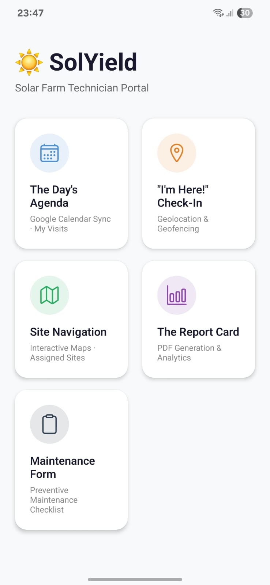
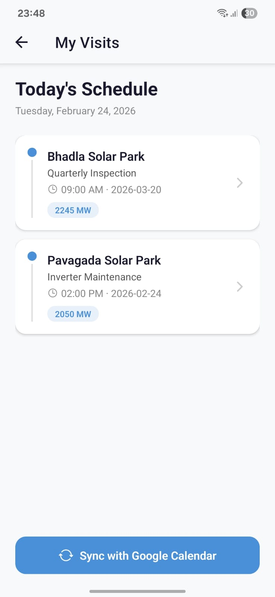
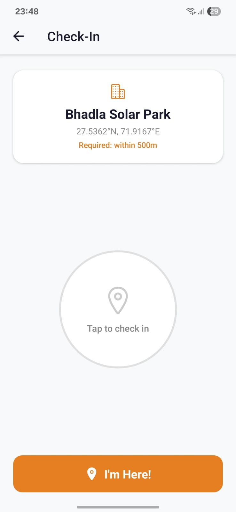
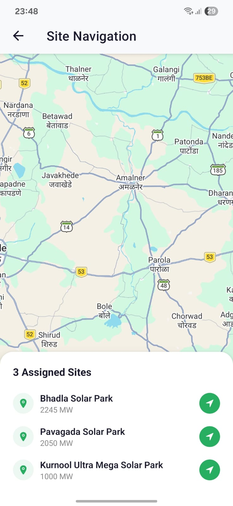
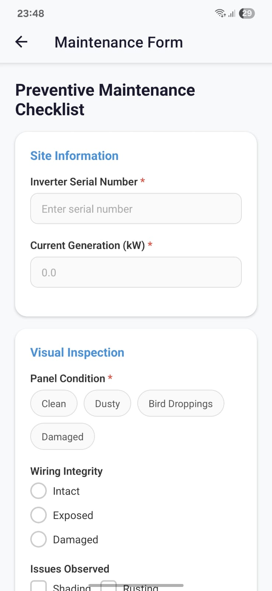
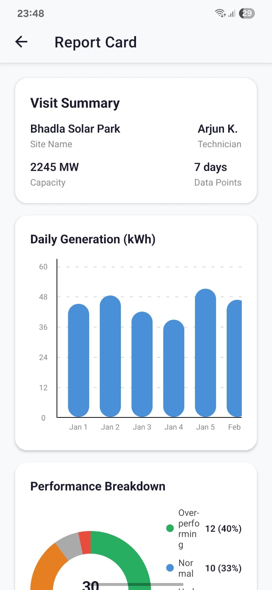
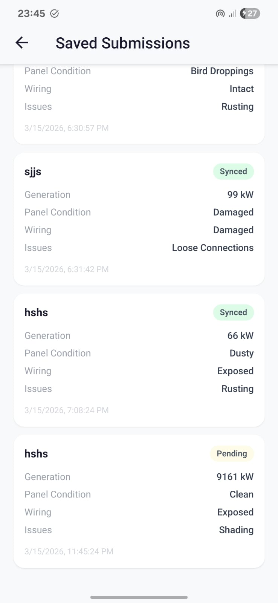
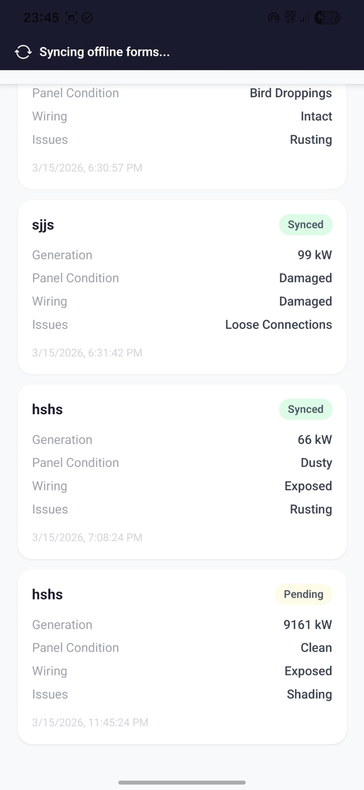
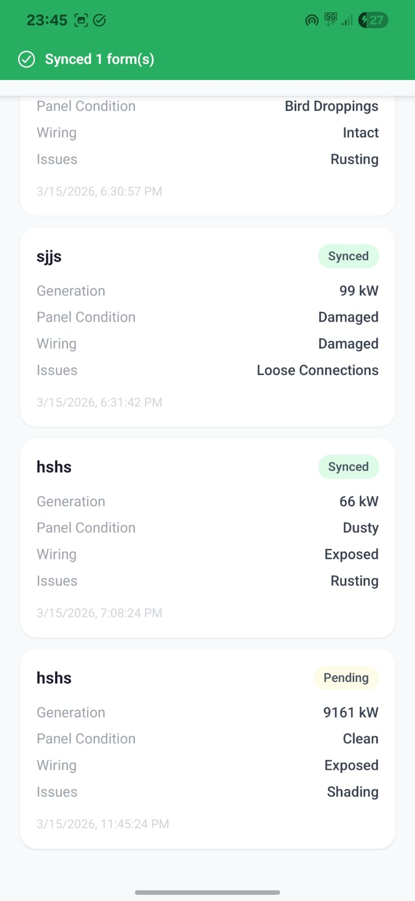

# SolYield

A mobile app for solar farm field technicians. Built with Expo (React Native) and TypeScript.

## Demo

https://github.com/user-attachments/assets/2f861043-4dcb-4443-9c1a-38d29ce7730d

## Screenshots
<p float="left">
  
  
  
  
  
  
  
  
  
</p>

## What it does

SolYield gives on-site technicians a single tool to manage their field work across large solar installations:

- **Day's Agenda** — View scheduled visits synced from Google Calendar. Each visit shows the site name, task type, scheduled time, and capacity.
- **"I'm Here!" Check-In** — Geofenced check-in requiring the technician to be within 500m of the site coordinates before logging attendance.
- **Site Navigation** — Interactive map showing all assigned sites (e.g. Bhadla Solar Park, Pavagada Solar Park, Kurnool Ultra Mega Solar Park) with direct navigation launch.
- **Maintenance Form** — Preventive maintenance checklist covering inverter serial numbers, current generation (kW), panel condition (Clean / Dusty / Bird Droppings / Damaged), wiring integrity, and observed issues.
- **Report Card** — Per-site performance dashboard with 7-day daily generation chart (kWh) and a performance breakdown (Overperforming / Normal / Underperforming).
- **The Black Box (Offline Storage)** — Implements local persistence using WatermelonDB to save complex nested form data, ensuring information survives app restarts when the internet is unavailable.
- **Sync-on-Reconnect** — Automatically detects network restoration and pushes all valid offline forms to the server via background sync.
- **Visual Evidence** — Resizes and compresses images locally to save space, stores image paths in the offline database, and syncs actual files once online.

## Tech stack

- **Expo** (React Native)
- **TypeScript**
- **NativeWind** (Tailwind CSS for React Native)
- **Expo Router** (file-based routing)

## Getting started

```bash
npm install
npx expo start
```

Then open in Expo Go, an Android emulator, or an iOS simulator.

## Project structure

```
src/          # App source code (screens, components, hooks)
app.json      # Expo config
tailwind.config.js
tsconfig.json
```

## Requirements

- Node.js 18+
- Expo CLI
- A device or emulator with location permissions enabled (required for geofenced check-in)
